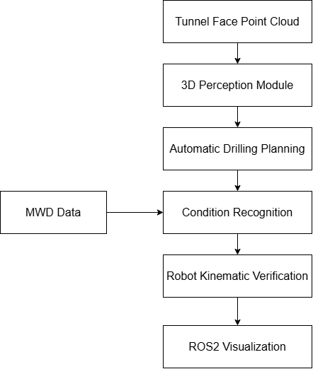
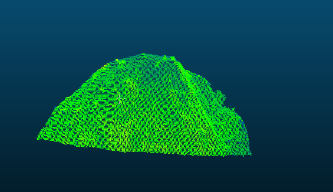
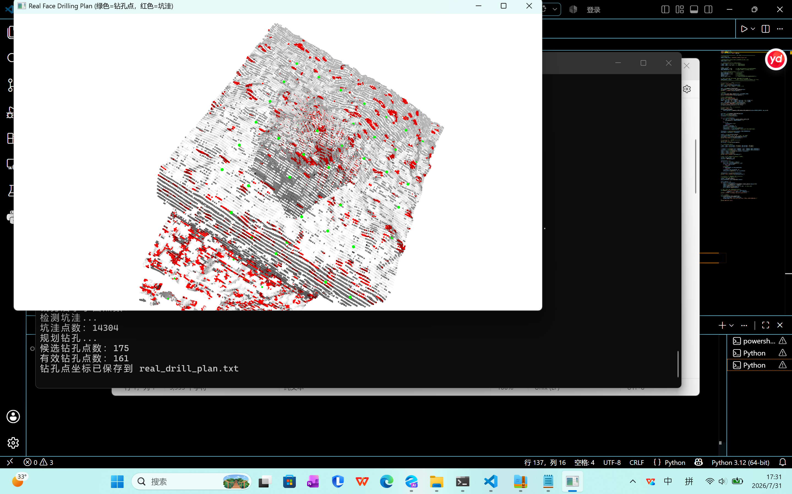
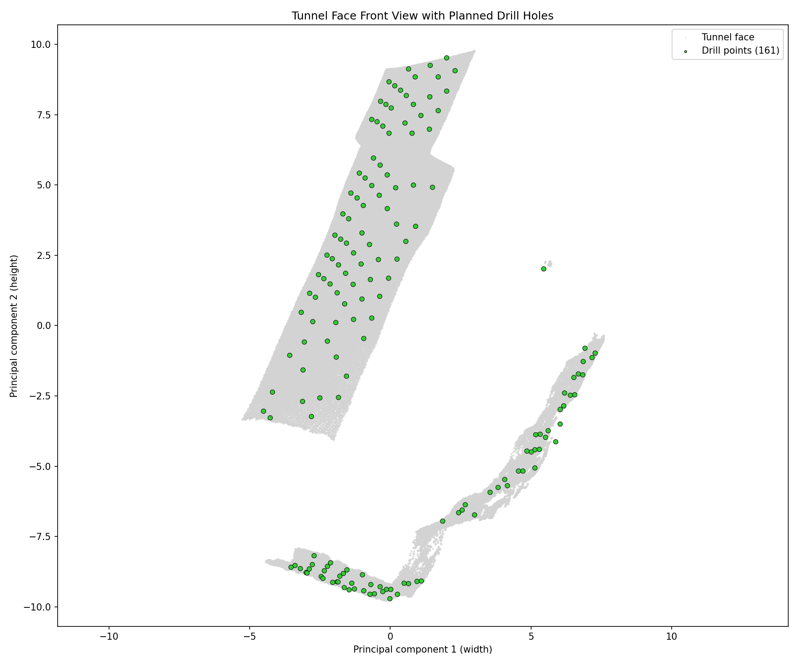
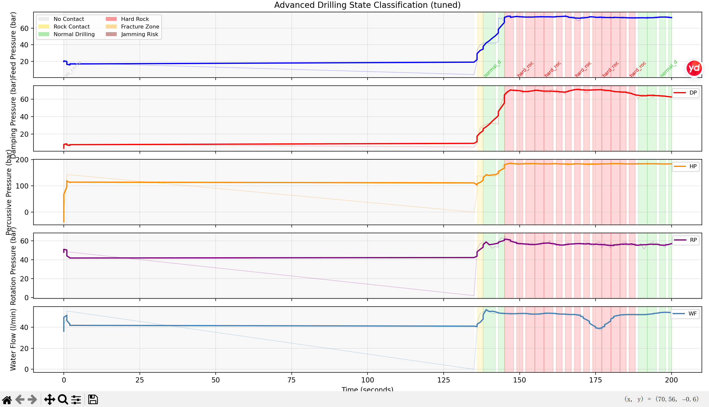
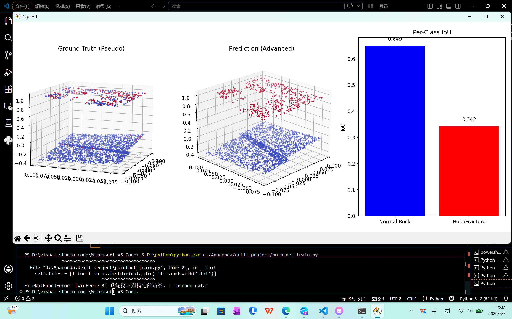
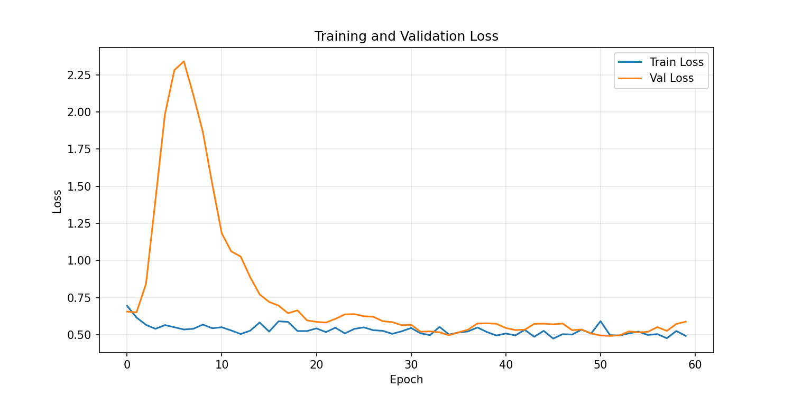
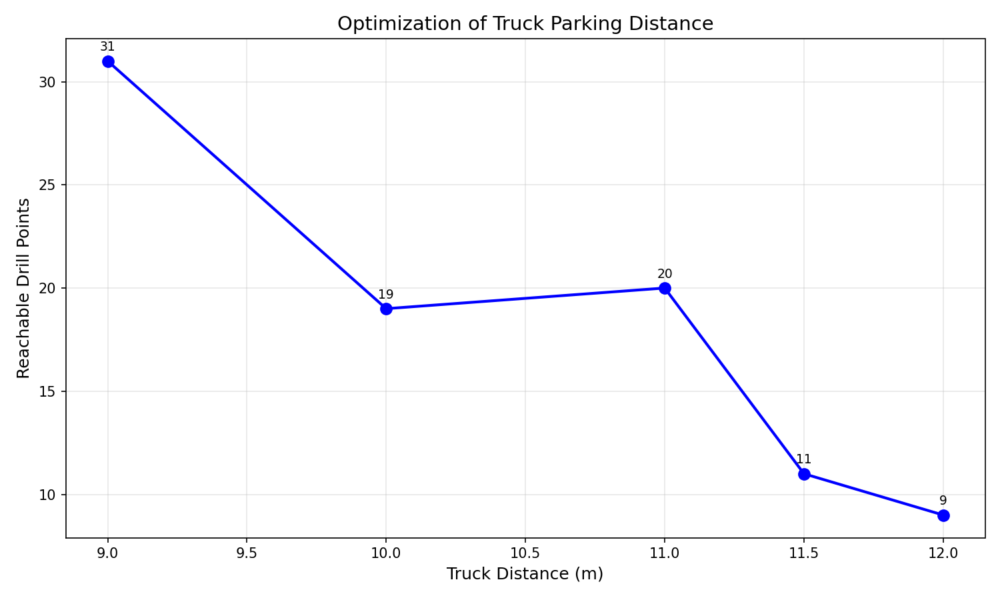
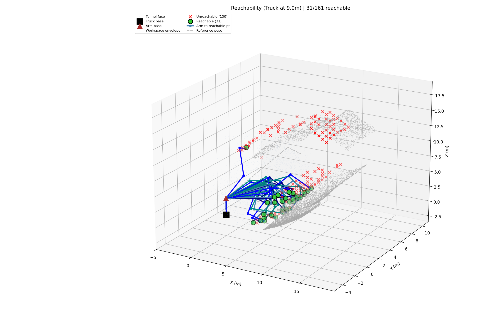
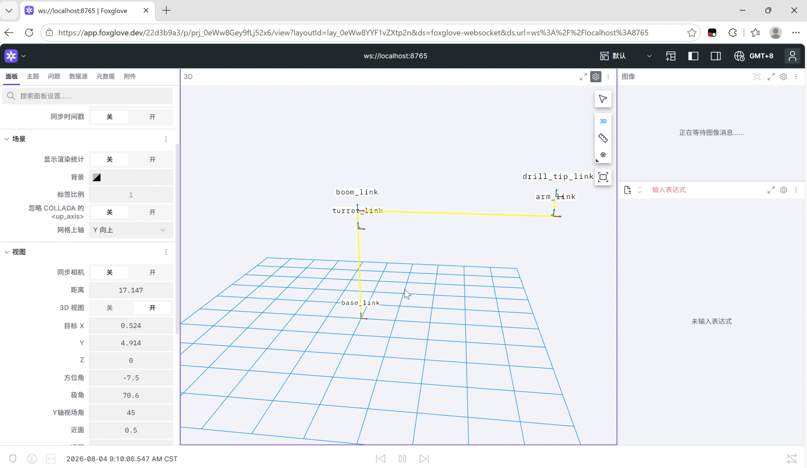

# Multimodal Perception and Robotic Motion Planning for Intelligent Tunnel Drilling Automation
An industrial robotic system integrating 3D perception, sensor-based condition monitoring, kinematic verification, and ROS2 visualization for autonomous tunnel drilling.

---

## Overview

Tunnel drilling automation remains a challenging problem in underground construction.

Unlike structured industrial environments, tunnel faces are highly irregular, containing uneven surfaces, cracks, and uncertain geological conditions. Current drilling operations still rely heavily on manual experience because machines lack sufficient environmental understanding and real-time feedback capability.

During my internship at a tunnel drilling equipment company, I identified this challenge and independently developed a multimodal intelligent drilling framework.

The system establishes a complete pipeline:

The project was developed using real industrial data, including:

- 7.06 million-point tunnel face point clouds
- Industrial MWD drilling sensor records
- Real drilling arm structural parameters

No public dataset or simulated-only environment was used.

---

The proposed framework contains four major components:

## 1. Vision-based Tunnel Face Understanding

A 3D point cloud processing pipeline was developed to analyze irregular tunnel surfaces and generate feasible drilling locations.

Main tasks:

- Point cloud preprocessing
- Surface reconstruction
- Roughness and curvature analysis
- Defect region identification
- Collision-aware drilling point generation

## 2. Sensor-based Drilling Condition Recognition

MWD (Measurement While Drilling) data was analyzed to understand drilling states during operation.

The system extracts multiple physical signals:

- Feed pressure
- Damping pressure
- Impact pressure
- Rotation pressure
- Feed speed
- Water flow

A rule-based classifier was developed to identify six drilling conditions:

| State | Description |
|---|---|
| State 0 | No rock contact |
| State 1 | Initial rock contact |
| State 2 | Normal drilling |
| State 3 | Hard rock |
| State 4 | Fractured zone |
| State 5 | Risk of jamming |

## 3. Robot Motion Feasibility Verification

To bridge the gap between planning and execution, a robotic arm kinematic model was established.

The drilling arm was modeled using Denavit-Hartenberg (D-H) parameters.

The system evaluates:

- Whether planned drilling points are reachable
- Optimal machine positioning distance
- Arm configuration feasibility

## 4. ROS2-based Visualization

The robotic system was integrated with:

- ROS2 Humble
- MoveIt2
- Foxglove Studio

The URDF model of the drilling arm was imported for:

- 3D visualization
- Joint motion verification
- Future simulation and deployment

---

# 1. 3D Point Cloud Processing and Drilling Planning

## Dataset

The input point cloud was collected from a real tunnel construction environment.

Original data:

- Number of points: >7 million
- Environment: irregular tunnel face

## Processing Pipeline

The original point cloud was too large for direct computation.

To improve efficiency:

1. Voxel downsampling was applied.
2. KD-tree spatial indexing was introduced.
3. Tunnel face region was extracted.
4. Local curvature was calculated.
5. Defective regions were removed.
6. Drilling points were generated according to engineering parameters.

Engineering parameters:
Hole spacing: 0.5 m

Row spacing: 0.6 m

Boundary clearance: 0.4 m

Final result:
Generated drilling points: 161

---

# 2. MWD Signal Processing and Drilling State Recognition

MWD data was obtained from industrial drilling sensors.

The original data format was undocumented, therefore the file structure was manually analyzed and parsed.

Processing pipeline:

 
 

Six drilling states were recognized:

- No contact
- Initial contact
- Normal drilling
- Hard rock
- Fracture zone
- Jamming risk

---

# 3. Deep Learning-based Rock Surface Segmentation

To explore data-driven perception methods, a PointNet semantic segmentation model was implemented.

Architecture:

- PointNet backbone
- T-Net spatial transformation
- Weighted loss function

The training labels were generated from curvature-based pseudo labeling.

Challenges:

Initial training failed because:

- Defect samples were extremely limited.
- Class imbalance caused model collapse.

Solutions:

- Adjusted pseudo-label threshold.
- Increased defect sample ratio.
- Applied class-weighted loss.

Results:

|Class|IoU|
|-|-|
|Defect region|0.33|
|Normal rock|0.80|

---

# 4. Robotic Arm Kinematic Verification

A 5-DOF drilling arm model was constructed using real industrial parameters.

Robot parameters:

|Parameter|Value|
|-|-|
|Main arm length|5.028 m|
|Second arm length|4.359 m|
|Feed beam stroke|3.5 m|
|Base height|2.7 m|
|Rotation range|±45°|

The planned drilling points were tested using forward kinematics and inverse kinematics search.

Initial condition:
Machine distance: 11.5 m

Reachable points:
3 / 161

After optimization:

Optimal distance:

9.0 m

Reachable points:

31 / 161

This experiment demonstrates the importance of considering robot execution constraints during planning.

---

# 5. ROS2 and Robot Visualization

The drilling arm model was integrated into ROS2 Humble and MoveIt2.

Development environment:
Ubuntu 22.04
ROS2 Humble
MoveIt2
Foxglove Studio
WSL2

During deployment, RViz rendering failed due to OpenGL compatibility issues.

Instead of abandoning visualization, a browser-based solution using foxglove_bridge was implemented.

The robot model was successfully visualized with joint motion control.

---

# Engineering Challenges

## Large-scale Point Cloud Processing

Problem:

7-million-point cloud caused memory and computation issues.

Solution:

- Voxel filtering
- KD-tree acceleration
- Region extraction

## Drilling Point Generation Failure

Problem:

Initial output contained zero valid points.

Cause:

KD-tree nearest neighbor search was affected by Z-axis scale.

Solution:

Performed search on XY plane using scipy cKDTree.

## Deep Learning Model Collapse

Problem:

PointNet predicted only normal rock.

Cause:

Severe class imbalance.

Solution:

- Adjusted pseudo labels
- Weighted loss

## ROS Visualization Failure

Problem:

RViz failed under WSL2.

Solution:

Integrated Foxglove Studio through foxglove_bridge.

---

# Technology Stack

## Robotics

- ROS2 Humble
- MoveIt2
- URDF
- D-H Kinematics

## Computer Vision

- Open3D
- Point Cloud Processing
- PointNet
- PyTorch

## Signal Processing

- MWD Data Analysis
- Savitzky-Golay Filtering
- Feature Extraction

## Programming

- Python
- C++
- Linux

---

# Future Work

Future development will focus on:

- Real-time perception and planning
- Gazebo-based simulation
- Closed-loop robot control
- Integration with autonomous drilling platforms

---

# Project Significance

This project represents a complete robotic perception-to-execution pipeline in an unstructured industrial environment.

Through this work, I explored how intelligent robotic systems can combine:

- Environmental understanding
- Sensor-based feedback
- Motion planning
- Robot execution constraints

The project strengthened my understanding of embodied intelligence and intelligent robotics, providing a foundation for future research in autonomous robotic systems.
